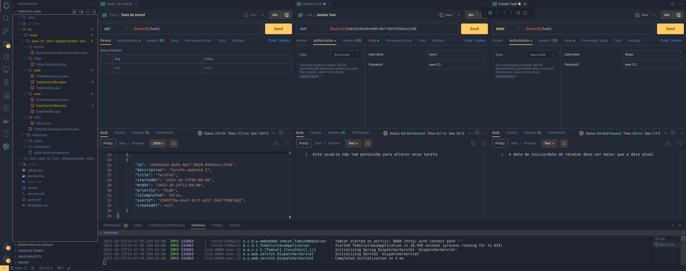

<h1 align="center">
    
</h1>
<h1 align="center">Java TodoList </h1>
<p align="center">API desenvolvida durante o cusro de Java da RocketSeat </p>

## Tecnologias
- [Java](https://www.java.com/pt-BR/)
- [Maven](https://maven.apache.org/)
- [PostgreSQL](https://www.postgresql.org/)
- [SpringBoot](https://spring.io/projects/spring-boot)
- [Docker](https://www.docker.com/)
- [Postman](https://www.postman.com/)

## Instalação
Certifique-se que possui Java(JDK) e Maven na versão 17. Depois rode o prijeto.

Subir a imagem do Postgres via Docker. Certifique-se que possui Docker instalado. Em seguida rode:
```bash
$ docker-compose up -d
```
Certifique-se que o usuário e senha do Postgres estão corretos em: src/main/resources/application.properties

Certifique-se que a imagem "postgres" está rodando com o comando:
```bash
$ docker ps
```
<h1 align="center">
    
</h1>

Made with ♥ by Diego Andrade :wave: [Get in touch!](https://www.linkedin.com/in/diego-r-andrade/)
